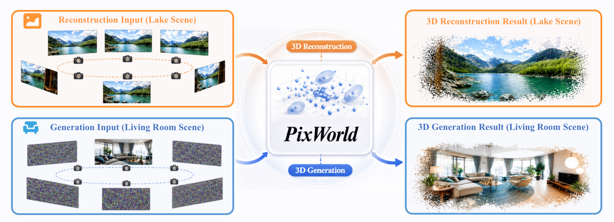

<div align="center">
<h1>
PixWorld: Unifying 3D Scene Generation and Reconstruction in Pixel Space</h1>

[Sensen Gao\*](https://sensengao.github.io/)<sup>1</sup>, [Zhaoqing Wang\*](https://derrickwang005.github.io/)<sup>2</sup>, [Qihang Cao](https://scholar.google.com/citations?user=oegbT6AAAAAJ&hl=zh-CN)<sup>1</sup>, [Dongdong Yu](https://scholar.google.com/citations?user=B2RmjSYAAAAJ&hl=zh-CN)<sup>2</sup>, [Changhu Wang](https://scholar.google.com/citations?user=DsVZkjAAAAAJ&hl=en)<sup>2</sup>, [Jia-Wang Bian📧](https://jwbian.net/)<sup>1</sup>

<sup>1</sup> Nanyang Technological University &nbsp;&nbsp; <sup>2</sup> AISphere &nbsp;&nbsp;|&nbsp;&nbsp; \* Co-first authors &nbsp;&nbsp; 📧 Corresponding author

<a href="https://arxiv.org/abs/2607.05373"></a>
<a href="https://sensengao.github.io/PixWorld/"></a>
<a href="https://github.com/SensenGao/PixWorld"></a>
<a href="https://www.modelscope.cn/models/SensenGao/PixWorld"></a>
<a href="https://huggingface.co/datasets/Sensen02/NVS-Refined"></a>

<p align="center">
  <a href="https://sensengao.github.io/PixWorld/">
    
  </a>
</p>

<p align="left">
<strong>TL;DR</strong>: <strong>PixWorld is a single end-to-end pixel-space diffusion model that unifies 3D scene generation and reconstruction</strong> — it supervises a pixel-aligned 3D Gaussian field directly through differentiable rendering, with no VAE or RAE, and adds a geometry perception loss for 3D structural consistency.
</p>

<p align="left">
<strong>Training code</strong> is in <a href="train/"><code>train/</code></a>, <strong>inference code</strong> in <a href="infer/"><code>infer/</code></a>, and the <strong>weights</strong> are on <a href="https://www.modelscope.cn/models/SensenGao/PixWorld">ModelScope</a>.
</p>

</div>

## ✨ Contributions

- **One unified model for generation *and* reconstruction.** A single two-stream diffusion transformer processes posed multi-view inputs as a **clean** subset (→ reconstruction) and a **noisy** subset (→ generation, optionally text-conditioned), decoding a pixel-aligned 3D Gaussian scene in **one forward pass** — no task-specific branches.
- **Pixel-space supervision, no VAE/RAE.** A **flow-matching loss is imposed directly on rendered multi-view images** via differentiable rendering, so optimization is aligned with 3D scene fidelity instead of an intermediate latent target — removing the frozen VAE/RAE and its reconstruction ceiling.
- **Geometry perception loss.** Rendered views are aligned with ground truth in the geometry-aware feature space of a **frozen 3D foundation model (π³ / VGGT)**, injecting 3D structural supervision beyond 2D photometric and perceptual losses.

## 🎬 Showcase

> One unified model, three capabilities — each grid shows six explorable 3D Gaussian scenes.
> ▶️ **Full-quality, playable videos on the [project page](https://sensengao.github.io/PixWorld/).**

### 🏗️ 3D Reconstruction

https://github.com/user-attachments/assets/837b6898-6fe2-4b66-ac80-d2331eee71fe

### 🖼️ Image → 3D

https://github.com/user-attachments/assets/b1e681f6-d3e3-4703-87fe-90a3d9f5c922

### ✍️ Text → 3D

https://github.com/user-attachments/assets/5353d7bf-5de3-4a3c-9b56-c49ca3db87ff

## 🚀 Code

This repository contains the full training and inference code.

| | what it is |
|---|---|
| **[`train/`](train/)** | two-stage training — fine-tune Wan2.2-TI2V-5B into a pixel-space 3D generator, then distil it to 4 steps. [Guide →](train/README.md) |
| **[`infer/`](infer/)** | text → 3D, image → 3D, and reconstruction from posed views. [Guide →](infer/README.md) |

Each directory is **self-contained** — the model, renderer, schedules and everything else
they need live under it, with no imports from anywhere outside. See also
[installation](INSTALL.md) and the [dataset format](train/DATASET.md).

> **Note.** The released 5B model is converted from **Wan2.2-TI2V-5B**, not the
> train-from-scratch model the paper reports, so the paper's numbers do not describe it.

### Weights

On ModelScope at **[SensenGao/PixWorld](https://www.modelscope.cn/models/SensenGao/PixWorld)**:
`PixWorld-L2P-Wan5B` (50-step) and `PixWorld-L2P-Wan5B-4steps` (4-step). Each `.safetensors`
sits beside a `config.json` that `infer.py` reads, so keep the two together.

```bash
export PIXWORLD=$(python -c "from modelscope import snapshot_download; print(snapshot_download('SensenGao/PixWorld'))")
export FEW=$PIXWORLD/PixWorld-L2P-Wan5B-4steps/PixWorld-L2P-Wan5B-4steps.safetensors
```

### Quick start

```bash
pip install torch==2.6.0 torchvision --index-url https://download.pytorch.org/whl/cu124
pip install -r infer/requirements.txt

# the Wan2.2 checkout is needed for its UMT5 text encoder
huggingface-cli download Wan-AI/Wan2.2-TI2V-5B-Diffusers \
    --local-dir weights/Wan2.2-TI2V-5B-Diffusers

# text + a camera path -> an explorable 3D Gaussian scene
python infer/infer.py \
    --ckpt $FEW \
    --wan_path weights/Wan2.2-TI2V-5B-Diffusers \
    --cameras infer/examples/poses/t2mv_living_room.json \
    --prompt "a cozy living room with a stone fireplace and a leather sofa" \
    --out out/livingroom
```

You get the generated views, a video rendered from the Gaussian field along the camera path
(`--video_frames 81`, `--video_round_trip` to fly out and back), and `scene.ply` — which
opens in any 3D Gaussian Splatting viewer.

A **camera path** is always required. `infer/examples/poses/` ships real ones taken from the
footage the model was trained on; `--trajectory {dolly,orbit,pan,spiral}` synthesises one
instead.

### Training

```bash
DATA_ROOT=data/mine bash train/train_l2p.sh                              # stage 1, 50k steps
TEACHER=runs/l2p/model_step50000.pt bash train/train_dmd2.sh             # stage 2, 10k steps
```

Both launchers are plain `torchrun` and scale to multiple nodes with `NNODES` / `NODE_RANK`
/ `MASTER_ADDR`. Every hyper-parameter is an environment variable carrying the published
default. See the [training guide](train/README.md) for what each one does.

Bring your own data in a plain local format — one JSON Lines index plus image folders, no
database and no object store. See the [dataset format](train/DATASET.md).

The **geometry perception loss** is implemented for both π³ and VGGT and is **off by
default** (`GEO_LOSS=none`): it needs one of those backbones cloned and its weights
fetched. Turn it on with
`GEO_LOSS=pi3` or `GEO_LOSS=vggt` — [details](train/README.md#the-geometry-perception-loss-optional-off-by-default).

## 📦 Dataset: NVS-Refined

We release **[NVS-Refined](https://huggingface.co/datasets/Sensen02/NVS-Refined)** 🤗 — a curated, high-quality dataset for novel view synthesis, distilled from **RealEstate10K, ACID, DL3DV, and SpatialVid**. From these sources we keep only the clips that are:

- **🔍 Sharp & high-fidelity** — visually clean frames, with blurry and heavily-compressed sequences filtered out.
- **🎥 Large in camera motion** — sequences with substantial pose variation, so the data genuinely stresses view synthesis and 3D geometry.
- **🎨 High in aesthetic quality** — scored and filtered for visual appeal.

For clips that are otherwise valuable but **noticeably blurry**, instead of discarding them we restore them with **Streaming FlashVSR** (streaming video super-resolution), recovering usable high-resolution detail.

👉 **[huggingface.co/datasets/Sensen02/NVS-Refined](https://huggingface.co/datasets/Sensen02/NVS-Refined)**

## 🗓️ Release Plan

- [x] 📦 **[NVS-Refined dataset](https://huggingface.co/datasets/Sensen02/NVS-Refined)** — released on Hugging Face 🤗
- [x] 🧑‍💻 **Training code** — both stages, [`train/`](train/)
- [x] 🎥 **Inference code** — [`infer/`](infer/)
- [x] ⚡ **Weights** — both checkpoints on [ModelScope](https://www.modelscope.cn/models/SensenGao/PixWorld)

## 🎓 Citation

If you find this repository useful, please consider citing PixWorld:

```bibtex
@misc{gao2026pixworld,
      title={PixWorld: Unifying 3D Scene Generation and Reconstruction in Pixel Space},
      author={Sensen Gao and Zhaoqing Wang and Qihang Cao and Dongdong Yu and Changhu Wang and Jia-Wang Bian},
      year={2026},
      eprint={2607.05373},
      archivePrefix={arXiv},
      primaryClass={cs.CV},
      url={https://arxiv.org/abs/2607.05373},
}
```
