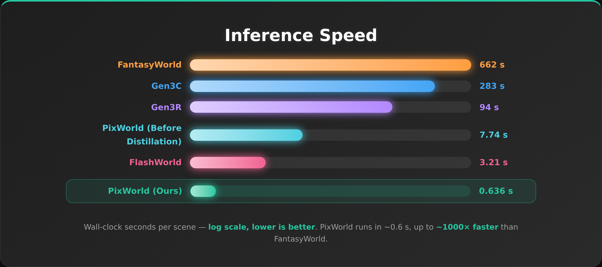

<div align="center">
<h1>
PixWorld: Unifying 3D Scene Generation and Reconstruction in Pixel Space</h1>

[Sensen Gao\*](https://sensengao.github.io/)<sup>1</sup>, [Zhaoqing Wang\*](https://derrickwang005.github.io/)<sup>2</sup>, [Qihang Cao](https://scholar.google.com/citations?user=oegbT6AAAAAJ&hl=zh-CN)<sup>1</sup>, [Dongdong Yu](https://scholar.google.com/citations?user=B2RmjSYAAAAJ&hl=zh-CN)<sup>2</sup>, [Changhu Wang](https://scholar.google.com/citations?user=DsVZkjAAAAAJ&hl=en)<sup>2</sup>, [Jia-Wang Bian📧](https://jwbian.net/)<sup>1</sup>

<sup>1</sup> Nanyang Technological University &nbsp;&nbsp; <sup>2</sup> AISphere &nbsp;&nbsp;|&nbsp;&nbsp; \* Co-first authors &nbsp;&nbsp; 📧 Corresponding author

<a href="https://sensengao.github.io/PixWorld/"></a>
<a href="https://arxiv.org/abs/2607.05373"></a>
<a href="#-todo"></a>

<p align="center">
  <a href="https://sensengao.github.io/PixWorld/">
    
  </a>
</p>

<p align="left">
<strong>TL;DR</strong>: <strong>PixWorld is a single end-to-end pixel-space diffusion model that unifies 3D scene generation and reconstruction</strong> — it supervises a pixel-aligned 3D Gaussian field directly through differentiable rendering, with no VAE or RAE, and adds a geometry perception loss for 3D structural consistency.
</p>

</div>

## ✨ Contributions

- **One unified model for generation *and* reconstruction.** A single two-stream diffusion transformer processes posed multi-view inputs as a **clean** subset (→ reconstruction) and a **noisy** subset (→ generation, optionally text-conditioned), decoding a pixel-aligned 3D Gaussian scene in **one forward pass** — no task-specific branches.
- **Pixel-space supervision, no VAE/RAE.** A **flow-matching loss is imposed directly on rendered multi-view images** via differentiable rendering, so optimization is aligned with 3D scene fidelity instead of an intermediate latent target — removing the frozen VAE/RAE and its reconstruction ceiling.
- **Geometry perception loss.** Rendered views are aligned with ground truth in the geometry-aware feature space of a **frozen 3D foundation model (π³ / VGGT)**, injecting 3D structural supervision beyond 2D photometric and perceptual losses.
- **Real-time inference.** After distillation, the **4-step** model (`PixWorld-480P-4steps`) generates a scene in **~0.6 s** — up to **~1000×** faster than diffusion-based world generators.

## 🎬 Showcase

> One unified model, three capabilities — each grid shows six explorable 3D Gaussian scenes.
> ▶️ **Full-quality, playable videos on the [project page](https://sensengao.github.io/PixWorld/).**

### 🏗️ 3D Reconstruction

https://github.com/user-attachments/assets/837b6898-6fe2-4b66-ac80-d2331eee71fe

### 🖼️ Image → 3D

https://github.com/user-attachments/assets/b1e681f6-d3e3-4703-87fe-90a3d9f5c922

### ✍️ Text → 3D

https://github.com/user-attachments/assets/5353d7bf-5de3-4a3c-9b56-c49ca3db87ff

## ⚡ Inference Speed

A **single** PixWorld model performs both 3D reconstruction and generation. After distillation, the **4-step** model (`PixWorld-480P-4steps`) generates a scene in **~0.6 s** — up to **~1000×** faster than diffusion-based world generators (FantasyWorld 1041×, Gen3C 445×, Gen3R 148×, FlashWorld 5×).

<p align="center">
  
</p>

## 🗓️ Release Plan

We plan to release the following **in a short time**:

- [ ] 🧹 **Cleaned RealEstate10K / DL3DV / ACID datasets**
- [ ] ⚡ **`PixWorld-480P-4steps` distilled model** — the 4-step distilled weights + inference code.

## 🎓 Citation

If you find this repository useful, please consider citing PixWorld:

```bibtex
@misc{gao2026pixworld,
      title={PixWorld: Unifying 3D Scene Generation and Reconstruction in Pixel Space},
      author={Sensen Gao and Zhaoqing Wang and Qihang Cao and Dongdong Yu and Changhu Wang and Jia-Wang Bian},
      year={2026},
      eprint={2607.05373},
      archivePrefix={arXiv},
      primaryClass={cs.CV},
      url={https://arxiv.org/abs/2607.05373},
}
```
